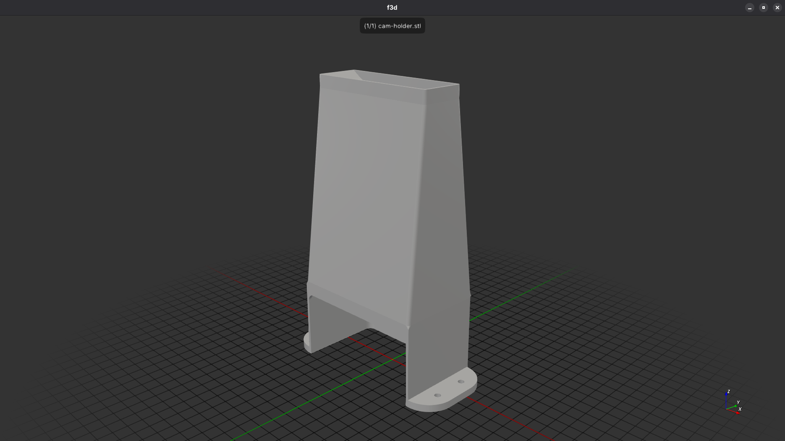
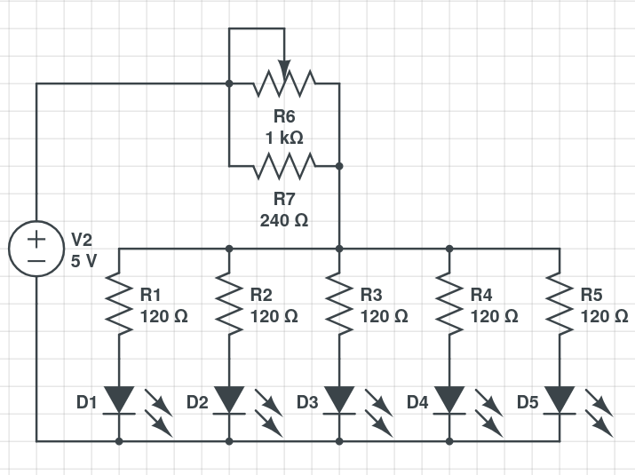

# python software for reading multimeter display
## dependencies
#### pytesseract, opencv, numpy
## dependency installation
### linux

#### arch linux
```bash
sudo pacman -S python-pip
```

#### debian/ubuntu
```bash
sudo apt install python3-pip
```
#### fedora
```bash
sudo dnf install -y python3-pip
```

### windows
```cmd
python -m ensurepip --upgrade
```

### macOS
```bash
python3 -m ensurepip
```

### installation
```bash
pip install opencv-python pytesseract numpy
```

## usage
```bash
python3 OCR.py -h # help


# result

# [ WARN:0@0.861] global cap_gstreamer.cpp:1777 open OpenCV | GStreamer warning: Cannot query video position: status=0, value=-1, duration=-1
# -h   --help                      displays this output
# -w   --without_units             displays results even without units (default)
# -u   --unit                      displays result only with readable units
# -c   --camera <camera number>    choosing camera (default 0)

# start

python3 OCR.py # add -u if you want only results with units, -c <number> for camera change
```

## support for fish [(friendly interactive shell)](https://fishshell.com/)
```bash
./clear.fish # clears captured_images and results (deletes those files)
```

## 3D model of cam holder
### for complete project you need
#### [logitech c920 camera](https://www.logitech.com/en-eu/shop/p/c920-pro-hd-webcam.960-001055)
#### 5x 5mm white LED
#### 0-1kΩ potentiometer or trimmer
#### 240Ω resistor
#### 5V power supply (minumim 100mA)
[3D model](cam_holder/cam_holder.stl)


## wiring

